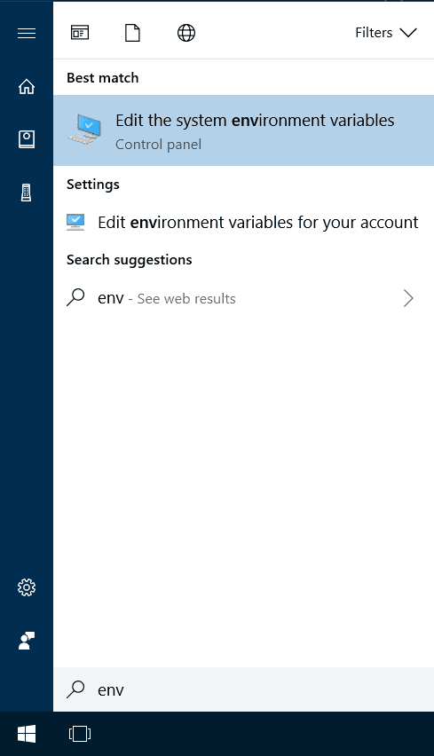
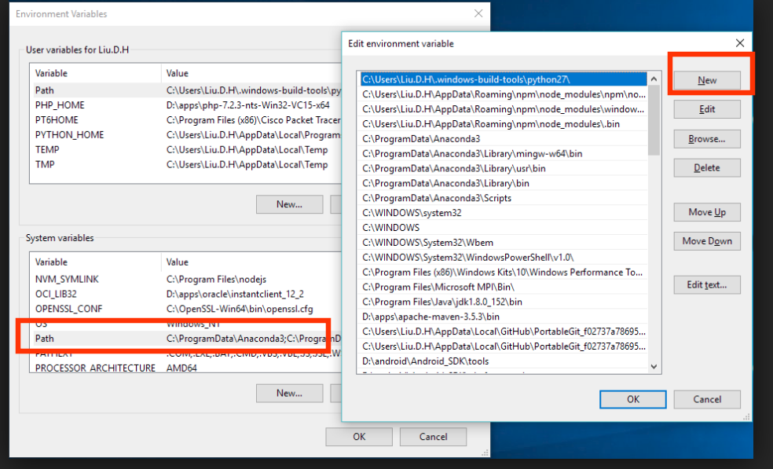

Install Arduino Environment
================

## Linux

### 1. Download Arduino IDE

[official download page](https://www.arduino.cc/en/Main/Software)

### 2. Install dependence 

Ubuntu for example:

```shell
sudo usermode -a -G dialout $(whoami)
sudo apt install python3 python3-pip
sudo pip3 install pyserial
```

### 3. Add board in Arduino IDE

* Add URLs

Open Arduino IDE, select `File` -> `Preferences`, 

Add `Additional Boards Manager URLs`: 

`http://dl.sipeed.com/MAIX/Maixduino/package_Maixduino_k210_index.json`

or 

`http://dl.sipeed.com/MAIX/Maixduino/package_Maixduino_k210_dl_cdn_index.json` (if download speed too low, try this URL)


* Install board tools and libs

Select `Tools` -> `Board` -> `Boards Manager`， search `Maixduino`, select latest version, click `Install`


### 4. Change settings about board

Change board settings in `Tools`  section on the top of Arduini IDE.

* `Board`: The same as your dev board
* `Burn Toolfirmware`: just for Maix Go Board, default `open-ec`
* `Burn Baudrate`: Decrease it if download fail
* `Port`: Serial port, e.g. `/dev/ttyUSB0`
* `Programmer`: Burn tool, must select `k-flash`


## Windows


### 1. Download Arduino IDE

[official download page](https://www.arduino.cc/en/Main/Software)

Then double click pack to install

### 2. Install dependence 

(We will remove this step in the future~ but now we have to do this step!)

* Add toolchain path to global environment path:

Find your toolchain path, it should be like this:

```
C:\Users\(username)\AppData\Local\Arduino15\packages\Maixduino\tools\riscv64-unknown-elf-gcc\8.2.0\bin
```

The username is your PC user's name


Open search tool, type in `env`, and choose `Edit the system environment variables` -> selet `Environment Variables` -> selct `Path` in `System variables` section -> Selct`New` -> copy your toolchain path -> click OK  to confirm







### 3. Add board in Arduino IDE

* Add URLs

Open Arduino IDE, select `File` -> `Preferences`, 

Add `Additional Boards Manager URLs`: 

`http://dl.sipeed.com/MAIX/Maixduino/package_Maixduino_k210_index.json`

or 

`http://dl.sipeed.com/MAIX/Maixduino/package_Maixduino_k210_dl_cdn_index.json` (if download speed too low, try this URL)


* Install board tools and libs

Select `Tools` -> `Board` -> `Boards Manager`， search `Maixduino`, click `Install`


### 4. Change settings about board

Change board settings in `Tools`  section on the top of Arduini IDE.

* `Board`: The same as your dev board
* `Burn Toolfirmware`: just for Maix Go Board, default `open-ec`
* `Burn Baudrate`: Decrease it if download fail
* `Port`: Serial port, e.g. `/dev/ttyUSB0`
* `Programmer`: Burn tool, must select `k-flash`


